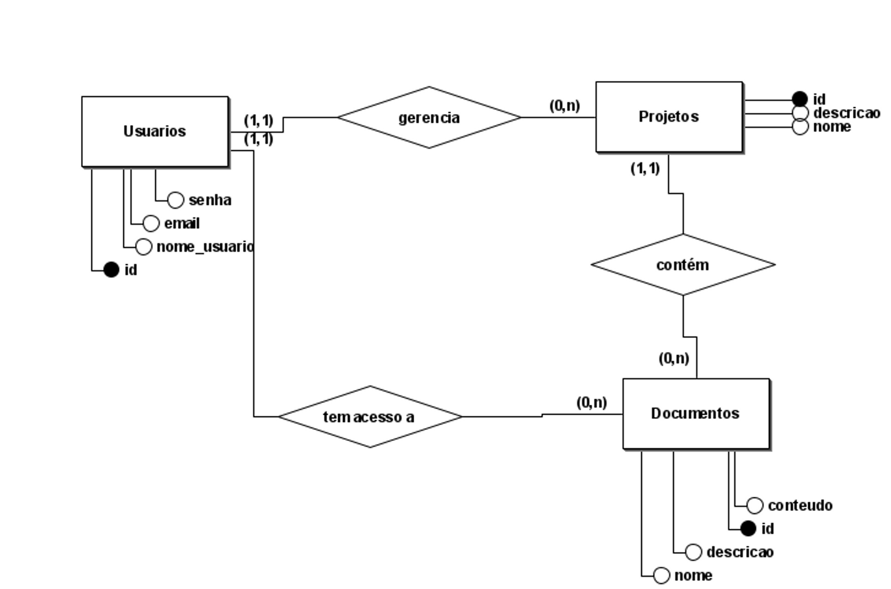

**Indice**

1. [Equipe T2D](#👥-equipe-t2d)
2. [Objetivo do Projeto](#👑-objetivo-do-projeto)
3. [Tecnologias Utilizadas](#🎈-tecnologias-utilizadas)
   1. [Frontend](#🌎-frontend)
   2. [Backend](#🤖-backend)
   3. [Banco de Dados](#💾-banco-de-dados)
4. [Modelagem do Banco](#💿-modelagem-do-banco-de-dados)
5. [Funcionalidades](#🎲-funcionalidades-da-app)

## 👥 Equipe T2D

| **Membro**                                            | **Responsabilidade(s)**                     |
| :---------------------------------------------------- | :------------------------------------------ |
| [David Teixeira](https://github.com/David-TM12)       | 🎲 Suporte Backend                          |
| Denner Pantoja                                        | 🔍 Artigo e Pesquisa                        |
| [Endrew Diaz](https://github.com/EndrewDias)          | 🎲 Suporte Frontend                         |
| Fernando Cosme                                        | 🔍 Artigo e Pesquisa                        |
| Iderlan Lira                                          | 🏴 Confecção do Banner & Suporte Artigo     |
| [Joelson Lima](https://github.com/swshadows)          | 🌎 Fullstack & Design das Telas             |
| [Leonardo Chagas](https://github.com/leonardosilva97) | 🎲 Suporte Frontend                         |
| Natanael Falcão                                       | 📔 Desenvolvimento do Artigo & Documentação |
| Oscar Oliveira                                        | 🔍 Artigo e Pesquisa                        |
| Stefanny Lohany                                       | 🍁 Confecção de Fôlders & Suporte Design    |
| Thiago Leão                                           | 👔 Confecção da Camisa & Identidade Visual  |

## 👑 Objetivo do Projeto

---

O projeto Task 2 Do (T2D), que foi construido na temática da Inovatec 2023 da FAMETRO, têm como objetivo facilitar a gerência de projetos colaborativos, utilizando de tecnologias modernas, responsivas e reativas para esse propósito.

## 🎈 Tecnologias Utilizadas

---

A stack utilizada para o desenvolvimento da aplicação é chamada **MEVN**

- `M`: Representa o banco de dados **M**ariaDB
- `E`: Representa o framework **E**xpress.js, usado no Backend com Node
- `V`: Representa o framework **V**ue.js, usado no Frontend
- `N`: Representa o **N**ode.js, utilizado no Backend

### 🌎 Frontend

#### [Vue.js](https://vuejs.org)

- Descrição: Vue.js é um framework progressivo Javascript que permite a criação de aplicações Web reativas através de uma linguagem única utilizando [Single File Components](https://br.vuejs.org/v2/guide/single-file-components.html) e tecnologia [Client Side Rendering](https://blog.cod3r.com.br/server-side-rendering-x-client-side-rendering/)
- Uso: Vue.js foi usado para criar as telas da aplicação, processar formulários diversos, consumir a [API](https://canaltech.com.br/software/o-que-e-api/) da aplicação e tudo relacionado a construção da UI/UX
- Justificativa: Vue.js é um framework simples de implementar e utilizar em aplicações Web, por sua linguagem ser Javascript, é extremamente leve, flexível e extensível. Abaixo alguns pacotes utilizados para extender funcionalidades

#### [NPM](https://www.npmjs.com)

- [Vue Router](https://router.vuejs.org): Pacote oficial do Vue responsável por gerenciar as páginas e rotas do cliente, simulando uma aplicação com várias páginas em um unico arquivo utilizando Javascript
- [Axios](https://axios-http.com): Um cliente simples baseado em promises para fazer requisições HTTP (`GET`, `POST`, `PUT`, `DELETE`, etc).
- [Pinia](https://pinia.vuejs.org): Um gerenciador de estados globais para Vue, utilizado para gerenciar os estados de login do usuário de forma local
- [Vue3 Markdown It](https://www.npmjs.com/package/vue3-markdown-it): Um renderizador de markdown em tempo real para Vue.js. Usado para melhorar o sistema de visualização de documentos com o poderoso Markdown

### 🤖 Backend

#### [Node.js](https://nodejs.org/pt-br/)

- Descrição: Node.js é uma plataforma e interpretador de código Javascript que funciona fora do navegador
- Uso: Node.js foi utilizado para criar os serviços backend da aplicação, como as resposta da [API REST](https://www.redhat.com/pt-br/topics/api/what-is-a-rest-api), comunicação com o banco de dados e tudo relacionado a infraestrutura da aplicação
- Justificativa: Node.js é uma tecnologia simples de utilizar, devido o mesmo fazer o uso da linguagem Javascript para rodar as tarefas. É possível instalar pacotes utilizando o gerenciador de pacotes [NPM](https://www.npmjs.com) para acelerar o desenvolvimento. Abaixo a lista de pacotes

#### [NPM](https://www.npmjs.com)

- [Express.js](https://expressjs.com): É um microframework Web backend que agiliza o processo de construção da API, sendo extremamente extensível e flexível.
- [Prisma](https://www.prisma.io): É um ORM que permite a comunicação com o banco de dados através do código
- [Express Session](https://www.npmjs.com/package/express-session): Permitiu criar as sessões de usuário, para gerenciar logins e logouts
- [Bcrypt](https://www.npmjs.com/package/bcrypt): Permite encriptar e decriptar as senhas
- [Typescript](https://www.typescriptlang.org): Um typeset do Javascript, que permite uma programação mais segura usando tipos de dados, POO melhorada e vários outros recursos
- [CORS](https://www.npmjs.com/package/cors): Permite a transmissão de dados entre origens cruzadas, permitindo a comunicação entre a app frontend e a API

### 💾 Banco de Dados

#### [MariaDB](https://mariadb.org/)

- Descrição: MariaDB é um sistema de gerenciamento de banco de dados relacional ([RDBMS](https://www.oracle.com/br/database/what-is-a-relational-database/)) de código aberto que se originou como um "fork" do [MySQL](https://www.mysql.com).
- Uso: MariaDB foi utilizada para gerenciar um banco de dados, para armazenamento e controle dos dados do usuário final
- Justificativa: O banco MariaDB é compatível com o MySQL, oferece recursos avançados e é amplamente utilizado em aplicações de diferentes áreas.

## 💿 Modelagem do Banco de Dados

## 🎲 Funcionalidades da App

	
🧑 Usuário

- Realizar cadastro
  - Deve-se enviar um email, nome de usuário, senha e repetição de senha
  - O email será validado com RegEx
  - O email e nome de usuário serão recusados caso estejam em uso
  - A senha será validada com RegEx
  - A senha será comparada com a repetição e encriptada com hash
- Realizar login
  - Deve-se enviar um email e senha cadastrados
  - O email será verificado e a senha comparada com o hash
  - O sistema realizará login alocando uma sessão e dando acesso a funcionalidades somente para usuários logados
- Realizar logout
  - O sistema validará o login e executará o logout, desalocando a sessão
- Atualizar email
  - Deve-se enviar um email novo
  - O email será validado com RegEx
  - O email será recusado caso esteja em uso
- Atualizar nome de usuário
  - Deve-se enviar um nome de usuário novo
  - O nome de usuário será recusado caso esteja em uso
- Atualizar senha
  - Deve-se enviar uma senha, nova senha e repetição da nova senha
  - A senha será comparada com o hash
  - A senha será validada com RegEx
  - A nova senha será comparada com a repetição da nova senha e encriptada com hash
- Deletar usuário
  - O sistema validará o login e executará a deleção da conta

	
📁 Projeto

- Criar um novo projeto
  - Deve-se validar se o usuário está logado
  - O projeto deve ter um nome e descrição obrigatórios
    - O nome deve ser menor que 20 caracteres
    - A descrição deve ser menor que 20 caracteres
- Editar o nome do projeto
  - Deve-se validar se o usuário está logado
  - Deve-se enviar um nome válido e menor que 20 caracteres
  - O sistema verifica se o ID do projeto enviado está correto e se pertence realmente ao usuário logado
- Editar a descrição do projeto
  - Deve-se validar se o usuário está logado
  - Deve-se enviar uma descrição válida e menor que 50 caracteres
  - O sistema verifica se o ID do projeto enviado está correto e se pertence realmente ao usuário logado
- Apagar um projeto
  - Deve-se validar se o usuário está logado
  - O sistema verifica se o ID do projeto enviado está correto e se pertence realmente ao usuário logado
- Mostrar os projetos do usuário
  - Deve-se validar se o usuário está logado
  - Se o usuário tiver projetos ≤ 0, retorna um erro `404`
  - Mostra os projetos

	
📄 Documento

- Criar um novo documento
  - Deve-se validar se o usuário está logado e se o projeto cujo documento está sendo adicionado pertence a esse usuário
  - Deve-se enviar um nome e descrição válidos
  - O documento deve ter um nome e descrição obrigatório
    - O nome deve ser menor que 20 caracteres
    - A descrição deve ser menor que 20 caracteres
- Pegar todos os documentos de um projeto
  - Deve-se validar se o usuário está logado e se o projeto cujo documentos estão sendo pegos pertence a esse usuário
  - O sistema retorna os documentos do projeto OU um erro `404` caso não hajam documentos cadastrados no projeto
- Pegar todos os documentos compartilhados com o usuário logado
  - Deve-se validar se o usuário está logado
  - O sistema retorna os documentos compartilhados com o usuário logado OU um erro `404` caso não hajam documentos compartilhados com o mesmo
- Compartilhar o documento do usuário logado com outro usuário
  - Deve-se validar se o usuário está logado
  - O sistema valida se o usuário a receber o compartilhamento é o mesmo do logado. Se sim retorna um erro
  - O sistema verifica se o usuário a receber existe realmente do banco de dados
  - O sistema valida se os dados estão condizentes, ou seja, se o documento a ser compartilhado realmente pertencem a um projeto do usuário logado E se o documento existe
  - O sistema deve verificar se o documento já está sendo compartilhado. Caso sim, remove o acesso do usuário anterior
  - O sistema adiciona acesso ao documento ao usuário enviado
- Remover o compartilhamento de um documento com outro usuário
  - Deve-se validar se o usuário está logado e se o documento em questão pertence a algum projeto do mesmo
  - O sistema valida se o documento realmente está sendo compartilhado
  - O sistema remove o acesso ao documento do outro usuário
- Atualizar o nome do documento
  - Deve-se validar se o usuário está logado e se o documento em edição pertence a algum projeto do usuário
  - Deve-se enviar um nome válido e menor que 20 caracteres
  - O sistema atualiza o nome do projeto
- Atualizar a descrição do documento
  - Deve-se validar se o usuário está logado e se o documento em edição pertence a algum projeto do usuário
  - Deve-se enviar uma descrição válida e menor que 50 caracteres
  - O sistema atualiza a descrição do projeto
- Deletar um documento
  - Deve-se validar se o usuário está logado e se o documento a ser deletado pertence a algum projeto do usuário
  - O sistema deleta o documento do projeto
- Pegar documento
  - Deve-se validar se o usuário está logado e se o documento a ser visto pertence a algum projeto do usuário OU se está sendo compartilhado com este usuário logado
  - Retorna o documento em questão
- Salvar documento (`conteúdo`)
  - Deve-se validar se o usuário está logado e se o documento a ser visto pertence a algum projeto do usuário OU se está sendo compartilhado com este usuário logado
  - Deve-se enviar o conteúdo do documento
  - Atualiza o conteúdo do documento

	
🌎 Frontend

- A app tem um sistema de mensagens para informar sobre erros e sucessos, baseado em regras internas e respeitando as regras de negócio implementadas na API
- A app tem um sistema de roteamento de views dinâmico, renderizando uma página 404 com instruções caso o usuário venha a ir para uma rota que não existe
- A app também conta com um sistema de redirecionamento, dependendo de estado de login e de respostas da API
- Ao realizar ações criticas, como deleção de dados, o usuário deve confirmar a escolha na tela, sendo exibido avisos sobre as consequências das ações descritas

